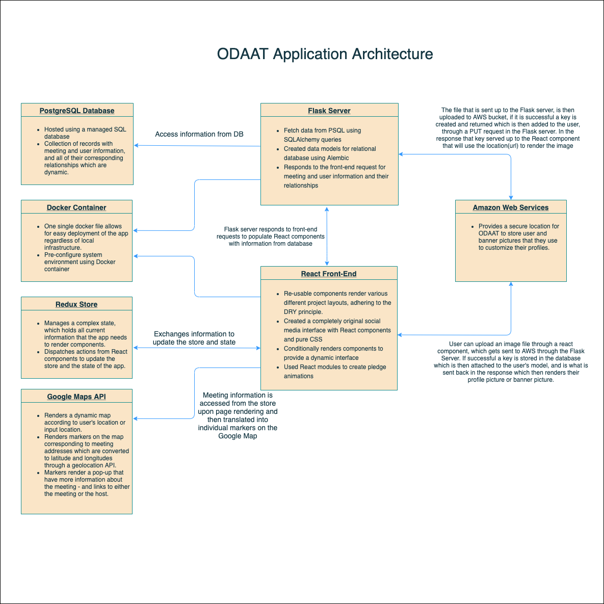

# [One Day At A Time](http://odaat-app.herokuapp.com)
*By Tadeo Garcia*

## Table of Contents:
- [ODAAT Overview](#odaat-overview)
- [ODAAT Application Architecture & Technology](#application-architecture)
- [ODAAT Front-end Overview](#front-end-overview)
- [ODAAT Back-end Overview](#back-end-overview)
- [ODAAT Moving Forward](#moving-forward)

# ODAAT Overview
One Day At A Time is an original social media app that is catered towards members of Alcoholics Anonymous. 

Users can host or browse meetings, official and non-official, through a Google Maps integrated API. 

It also has the functionality of other traditional social media apps, like customizing your profile picture or banner, and following other users.

<!-- Homepage gif -->

# Application Architecture
ODAAT is a fullstack application that employs a React/Redux based front-end interface, and a Flask/SQLAlchemy powered back-end server.

API calls are made to the Flask back-end, and the responses are directed and made available to the corresponding React components via the Redux Store.

Additionally to deploy the whole app, front and back-ends, you need to have an updated build of the React Front-end and then run the Docker file that is in the back-end.

# Front-end Overview

## React
React components are the key foundation to the app's minimalistic feel while still providing the user all the functionality of a traditional social media app. Components allow for 'DRY' code, and give the ability to render similar components multiple times with only the content being what is changed throughout. The following code snippet shows how a list of meetings that are avaible, is rendered as soon as you log in to the site.

<!-- meetings code snippet -->

## Redux
Redux, react-redux, and redux-thunk work together to manage the application's state. Through the state the app can maintain a current list of meetings or combination of meetings depending on which profile you are viewing. This allows for fast rendering of meeting markers on the Google map.

<!-- Map gif -->

Additionally, in the Sobriety Calculator component there is a react-confetti module that creates an animation whenever the user's sobriety date is calculated!

<!-- confetti gif -->

Redux also stores and sets the information of the user that is currently logged in. This allows for different functionality across the site only if the user is authenticated. By storing the user's information in state, they have access to their meetings, followers and following lists. They can create or edit meetings, as well as their profiles which has information that they can choose to be public or private to others.

# Back-end Overview
ODAAT uses a Flask server along with a PostgreSQL database to manage and serve data to the front-end. In comparison to the component heavy React based front-end, the back-end is much more straight-forward and simple. This is a great benefit whenever creating, testing and debugging new back-end API routes.

Requests are made from the front-end, specifically from the corresponding Redux store once a React component has dispatched an action. The data is then retrieved from the PSQL database after it has hit it's corresponding back-end route and then returned to the Redux store where it is set in state and made accessible to the React component that originally made the request.

## Back-end Technologies
Flask was used to create our server, and PostgreSQL our relational database. SQLAlchemy was used to generate the data models and their relationships to others. Migrations and their versions were handled using Alembic.

## Moving Forward!
I have many, many features that I would like to work on in the future but I have to take one day at a time! First, I would like to implement a messaging system for users to communicate with each other. Second I would like to implement a hashtag system that users can use to search for certain types of meetings, whether it be #closed, #open, #parents etc. 

If you made it this far, thank you so much for reading! I had a great time working on this project and I hope to continue to work on it until all of the features have been added!

Credits:
  Thank you [Soon-mi Sugihara](https://github.com/ssoonmi/) and [Steven Tegnelia](https://github.com/uribgp) for all of your help and guidance throughout this process, could not have done it without you guys!